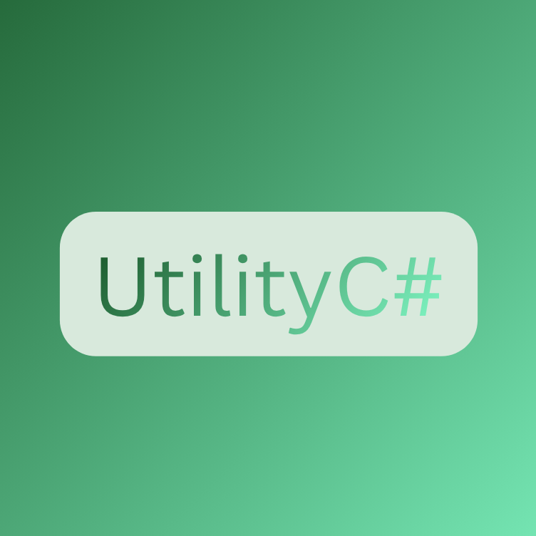

# C# Utility Library
A wide-range `Net 9.0` C# Utility Library

## Usage
- Serializing and Deserializing Data (JSON, XML, BINARY)
- File Management
- Randomization
- Encryption and Decryption
- Password Generation
- Mathematics
- Logging
- Mini LINQ
- CMD Utils

## How to use

### Option 1 - Clone the Repository
1. Clone with  
   `https://github.com/Ben-Scr/UtilityCS`
2. Add `UtilityCS.csproj` to your project  
   **or** test the features directly in `UtilityPlayground.csproj`.

### Option 2 - Install via NuGet
1. Install the package from NuGet:
   ```bash
   dotnet add package UtilityCS

## Technology
<p align="center">


   
</p>
